#  RaspberryPi Server Setup

A self-hosted privacy and storage stack running on a **Raspberry Pi 4**, built from scratch. This project combines private DNS resolution, ad blocking, encrypted VPN tunneling, and self-hosted cloud storage into a single home server, all accessible securely from anywhere in the world.

---

##  Architecture Overview

```
VPN Devices (iPhone, MacBook)
        │
        ▼
  WireGuard VPN (Pi)
        │
        ▼
   Pi-hole (DNS Filtering + Ad Blocking)
        │
        ▼
   Unbound (Private DNS Resolver)
        │
        ▼
   Root DNS Servers (no third party)

   + Nextcloud (Self-Hosted Cloud Storage on 1TB External Drive)
```

---

##  Unbound — Private DNS Resolver

### What it does
Unbound is a self-hosted recursive DNS resolver that eliminates reliance on third-party DNS providers like Cloudflare (1.1.1.1) or Google (8.8.8.8). Instead of forwarding DNS queries to an upstream provider, Unbound resolves domains by querying the root DNS servers directly, meaning no third party ever sees what domains are being looked up.

### Why it matters
Before Unbound, the DNS chain looked like this:
```
Device → Pi-hole → Cloudflare → Answer
```
Cloudflare could see every domain lookup. After Unbound:
```
Device → Pi-hole → Unbound → Root DNS Servers → Answer
```
No upstream provider is involved. DNS queries never leave the home network.

### Configuration File
The Unbound config was written to `/etc/unbound/unbound.conf.d/pi-hole.conf`, setting it to listen on port 5335 with DNS hardening options enabled.

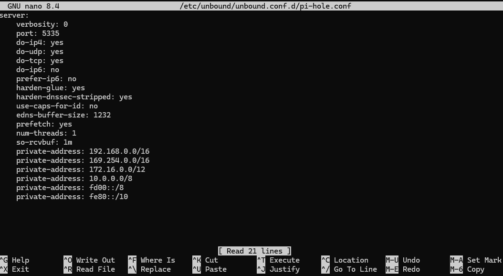

### Pi-hole Integration
All third-party upstream DNS providers were removed from Pi-hole and replaced with `127.0.0.1#5335`, pointing directly to the local Unbound instance.

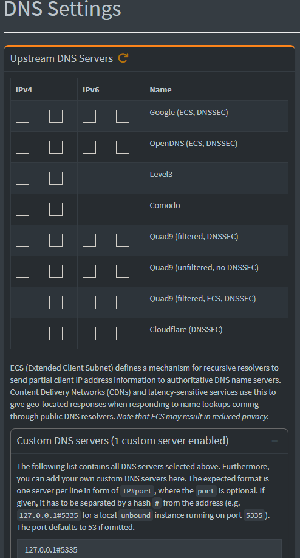

### Verified Working
After setup, a `dig` query was run against Unbound directly to confirm it was resolving DNS through the root servers correctly.

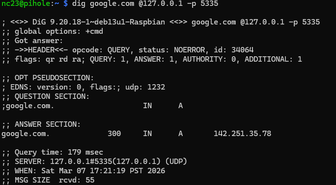

The query returned a valid response with `status: NOERROR` and was served by `127.0.0.1#5335`, confirming Unbound is fully operational. Query time dropped from **179ms** on the first cold query to **0ms** on subsequent requests due to caching.

---

##  Nextcloud — Self-Hosted Cloud Storage

### What it does
Nextcloud is a self-hosted alternative to Google Drive and iCloud. Files are stored locally on a **1TB external drive** connected to the Pi, accessible from any device through the WireGuard VPN tunnel.

### Why it matters
All uploaded files stay on personal hardware. No third-party cloud provider has access to the data. Access is gated behind the WireGuard VPN, meaning Nextcloud is completely invisible to the public internet.

### Dashboard


The Nextcloud web interface is accessible at `http://10.86.12.1:8080` when connected to the VPN, and at `http://192.168.1.61:8080` on the local home network.

### Trusted Domain Configuration
Nextcloud's trusted domains whitelist controls which addresses are allowed to access the instance, adding a layer of security against unauthorized access attempts.

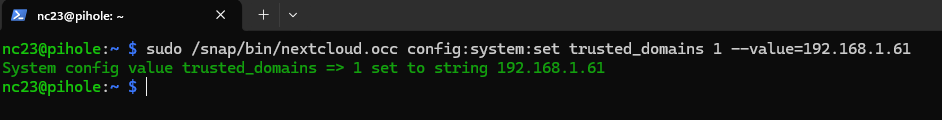

Both the local network IP (`192.168.1.61`) and the VPN IP (`10.86.12.1`) are registered as trusted domains, enabling access from home and remotely through the VPN.

---

##  External Drive Setup — 1TB Storage

### Formatting and Mounting
The 1TB external drive was formatted as **ext4** and mounted at `/mnt/nextcloud` for optimal performance and reliability with Linux-based services.

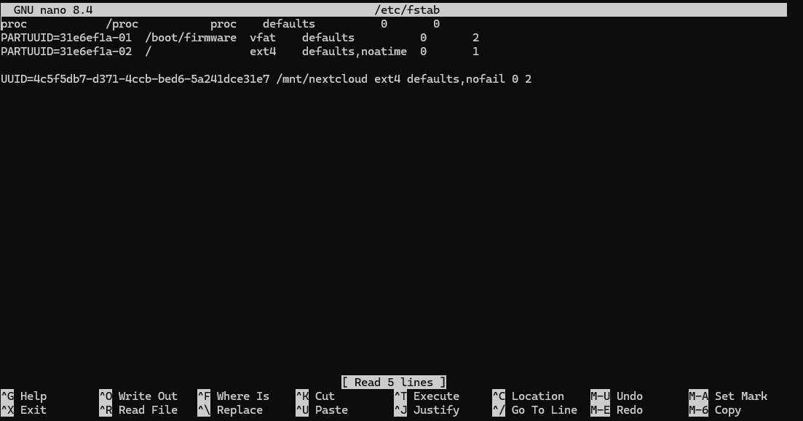

The drive's UUID is registered in `/etc/fstab` with the `nofail` flag, ensuring the Pi boots normally even if the drive is disconnected.

### Data Directory Migration
Nextcloud's data directory was migrated from the SD card to the external drive, preventing SD card wear and providing significantly more storage capacity.

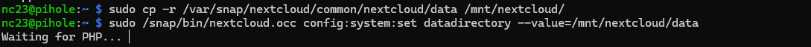

### Permissions
Correct file ownership and permissions were configured to allow Nextcloud's web server to read and write to the external drive securely.

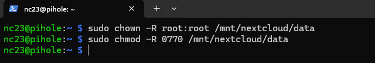

The Nextcloud snap was also granted explicit `removable-media` access, required for snap-confined applications to access external mount points.

---

##  Tech Stack

| Component | Technology |
|-----------|------------|
| Hardware | Raspberry Pi 4 |
| VPN | WireGuard |
| DNS Filtering | Pi-hole |
| DNS Resolver | Unbound |
| Cloud Storage | Nextcloud (Snap) |
| Storage | 1TB External Drive (ext4) |
| OS | Raspberry Pi OS (Debian) |

---

##  Multi-Device Access

All devices connect to the server through WireGuard with two tunnel configurations:

- **Full Tunnel** routes all traffic through the Pi, used away from home with auto-connect on public WiFi via On Demand
- **Split Tunnel** routes only VPN network traffic through the Pi, used at home to avoid unnecessary round trips

---


## Fail2Ban — Brute Force Protection

### What it does
Fail2Ban monitors system logs for repeated failed login attempts and automatically 
bans offending IP addresses using firewall rules. It protects the server from 
brute force attacks targeting SSH and other services.

### Why it matters
Without Fail2Ban, an attacker can attempt thousands of password combinations 
against SSH with no consequences. Fail2Ban detects this pattern and blocks the 
IP at the firewall level before the attack can succeed.

### Configuration
The default settings were hardened in `/etc/fail2ban/jail.local`:

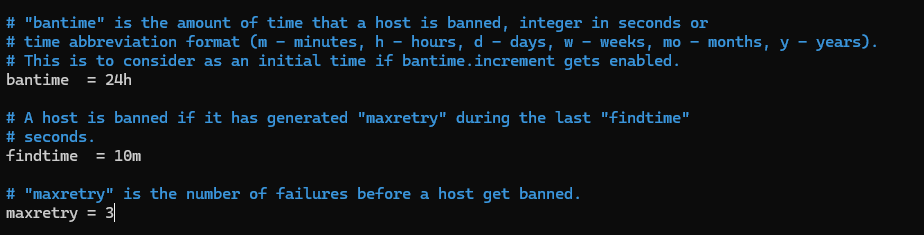

| Setting | Value | Meaning |
|--------|-------|---------|
| `bantime` | 24h | Banned IPs are blocked for 24 hours |
| `findtime` | 10m | Failed attempts are counted within a 10 minute window |
| `maxretry` | 3 | 3 failed attempts triggers a ban |

### Service Status
Fail2Ban runs as a systemd service and is enabled on boot.

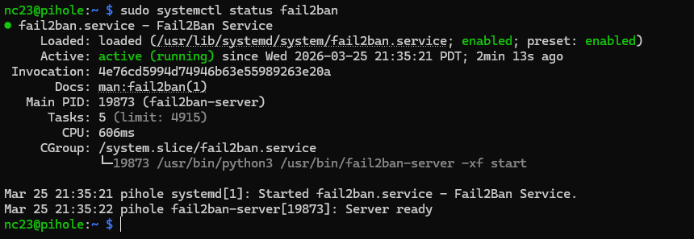

### SSH Jail
Fail2Ban uses "jails" to monitor specific services. The SSH jail watches 
`/var/log/auth.log` for failed login attempts and bans any IP that exceeds 
the retry limit.

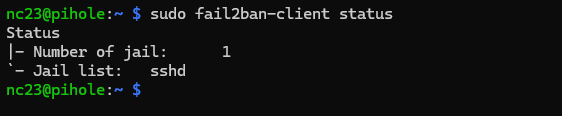

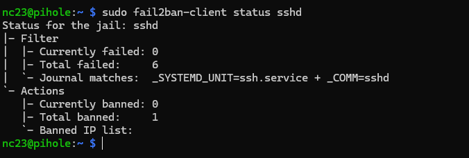

### Verified Working
A brute force simulation was performed by attempting SSH logins with an invalid 
username multiple times. After 3 attempts the source IP was automatically banned, 
confirming Fail2Ban is actively protecting the server.

## 🔗 Related Projects

- [Raspberry Pi VPN](https://github.com/nc23t) — WireGuard VPN server setup with Pi-hole integration

